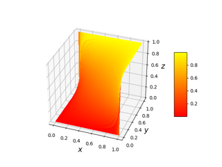

# LaplacianGrapher

## TLDR
Graphs the solution curve to Laplace's equation (using numerical approximations and linear programming) given 4 boundary functions along the unit square. 

## The Math behind this stuff
(coming soon)

## Examples
For the sake of simplicity and github's lack of mathjax support, denote Lower() as the function on the set of points (x,0), where 0 <= x <= 1, Upper() as the function on the set of points (x,1) where 0 <= x <= 1, Left() as the function on the set of points (0,y) where 0 <= y <= 1, and Right() as the function on the set of points (1,y), where 0 <= y <= 1.

Ex 1.  Lower() = 0, Upper() = 1, Left() = 0, and Right() = 1

